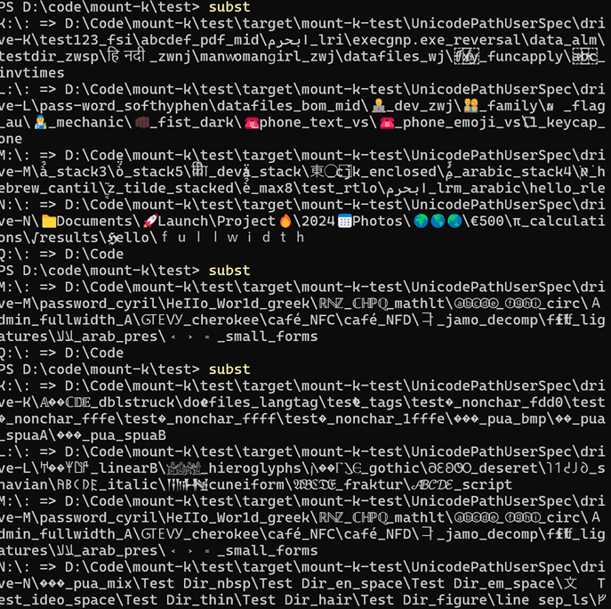

# mount-k

A single `.bat` file that turns any directory into a virtual drive letter.

I hate opening up the `cmd` if I don't need to. \
Plonk the script into where you need it and just keep it there. \
Rename it to pick your drive letter - e.g. `mount-p.bat` for `P:`

# Why

Standing on top of `SUBST`, this util allows you to pin certain folders to be
in the same path e.g. `X:\mystuff` across different devices.
Not every laptop has the same drive setup and this helps ensuring your setup
is closer to being identical, if you need that.

Or e.g. to fix extremly gruesome super long directory names by splicing them off
into something simpler like converting `C:\Users\melezov\AppData\Local\Coursier\cache\arc\https\github.com\adoptium\temurin21-binaries\releases\download\jdk-21.0.10%252B7\OpenJDK21U-jdk_x64_windows_hotspot_21.0.10_7.zip\jdk-21.0.10+7\bin\java.exe`
into `J:\bin\java.exe`

The unfortunate `%` in that Coursier path beautifully breaks every tool that
tries to do something with Java - be it Bash interop, firewall rules, you name it.
`J:\bin` doesn't.

### UAC / Noop

When you run the script - a UAC prompt will appear so that the mapping is baked into the registry and that it survives reboots. The script is idempotent, so running it multiple times is a NOOP.

```
mount-k.bat v0.2.0 - https://github.com/melezov/mount-k

Usage: mount-k.bat [/M|/D|/?]
  <no args> - same as /M [default]
  /M        - mount K: to d:\Code\mount-k\ and persist across reboots
  /D        - unmount K: and remove the boot-time registry entry
```

Rename the script to `unmount-k.bat` and the default flips:

```
unmount-k.bat v0.2.0 - https://github.com/melezov/mount-k

Usage: unmount-k.bat [/M|/D|/?]
  <no args> - same as /D [default]
  /M        - mount K: to d:\Code\mount-k\ and persist across reboots
  /D        - unmount K: and remove the boot-time registry entry
```

## Notes

- The reboot persistence lives in `HKLM\SYSTEM\CurrentControlSet\Control\Session Manager\DOS Devices`, which is machine-wide. Every user on the box will see the drive letter at boot; users who can't read the backing directory will just see a broken drive icon.
- There's a lot of tests, specs for both unicode and logic - the end goal is to have a gazillion of tests covering all sorts of flag combinations and scenarios in the future: [mount-k Spec](https://github.com/melezov/mount-k/blob/main/test/src/test/scala/com/github/melezov/mountk/MountKSpec.scala)
- If you want to run tests, just do a `cd test && sbt test` - you'll need to have a JVM and SBT installed - prepare for crazyness



## TODO

- *It's incredible how things become complicated when you go a bit deeper*
- Support a path argument so that we can mount DVDs, UNCs, etc...
- Guard against 8.3 short-name collisions at boot so that the Session Manager doesn't automount the wrong directory.
- `/status` flag of sorts - since running without args does an automatic mount - should we act as `subst` if they rename the app to just `mount.bat`?
- Drive-letter denylist - configurable list of letters the script refuses to mount (e.g. `A`/`B`)
- Orphan detection - when the registry boots a mount but the script is gone, surface that so the user can clean up via another script.
- Add support flags on the top of the script so that the user can configure a bunch of default behaviours
- e.g. should we even try to do a persistent mount every time? Or should we ask y/n?
- e.g. how should we do chaining of substs? Should we auto mount ourselves if we go deeper into the mount, or reference the original path?
- e.g. flag for subst only, skip UAC and the HKLM write for throwaway mounts
- Per-user persistence? For non-admin users: install a Task Scheduler login trigger instead of HKLM, so the mapping persists without UAC...
- Recycle Bin behaviour on subst drives - document and (if necessary) work around how Windows handles `$Recycle.Bin` under a subst mapping
- Drive-icon customization, set desktop.ini at the mount root?

## License

[MIT](https://opensource.org/licenses/MIT)
